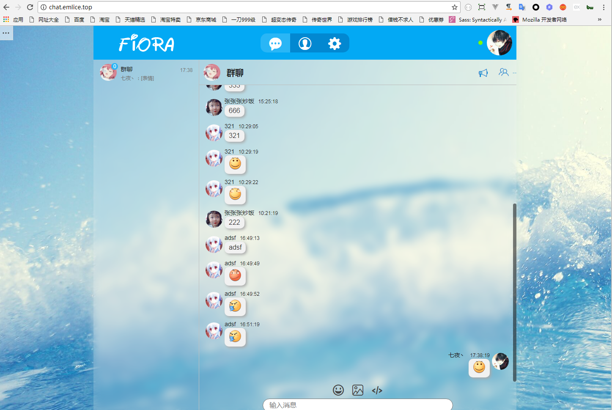

# **EmliceChat**

语言: [简体中文](REMEAD.md)

EmliceChat是一款web聊天应用. 使用node.js, express和jquery编写.

## 功能

#### 未完成
1. 消息撤回
2. 私聊 typing 状态
3. 当地天气状态
4. 新建群聊 && 加入群聊
5. 歌曲循环(单曲循环/顺序播放/随机播放)

#### 已完成

1. 创建用户, 私聊, 群聊
2. 文本, 图片, 代码, url,截图,跨域图片等多种类型消息
3. 桌面通知, 声音提醒, 通知开关
4. 头像修改, 群组公告修改,用户信息修改
5. 简易的插件系统
6. 内置音乐播放器
7. 消息类型自动解析
8. 剪切板复制图片
9. 反防盗链技术

## 安装

该项目依赖于node.js(>= 8.2.1)和mongodb数据库. 安装[node.js](https://npm.taobao.org/mirrors/node). 安装[mongodb](https://docs.mongodb.com/manual/installation/).

0. 克隆项目到本地
      `git clone git@https://github.com/zyw5791557/EmliceChat`
1. 进行项目目录执行
  `yarn` 或者 `npm install
2. 运行项目服务端
  `node index` 或者 `nodemon index`
3. 打开 `http://localhost:3000` 查看效果

## 运行截图

## 目录结构

    |-- [public]                 // 前端项目 文件夹
    |-- [servre]                  // 服务端代码
    |    |-- api.js               // api 接口
    |    |-- connect.js           // mongoDB 连接文件
    |    |-- model.js             // mongoDB 表模型
    |-- index.js                  // 服务端主逻辑代码
    |-- package.json              // npm
    |-- yarn.lock                 // yarn
    ...

## 备注

1. 该项目 UI 和 功能 参考自碎碎酱的https://github.com/yinxin630/fiora 
2. 代码全部自己完成。